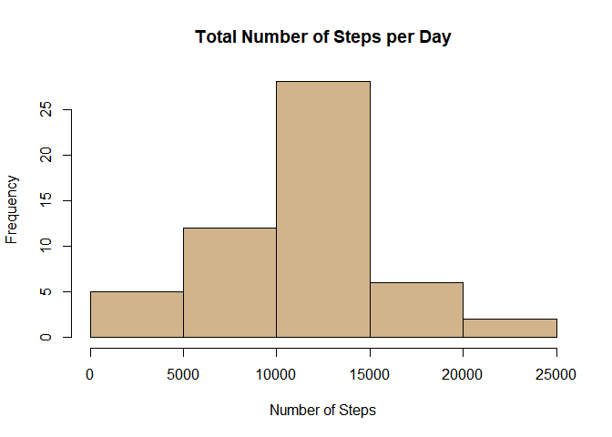
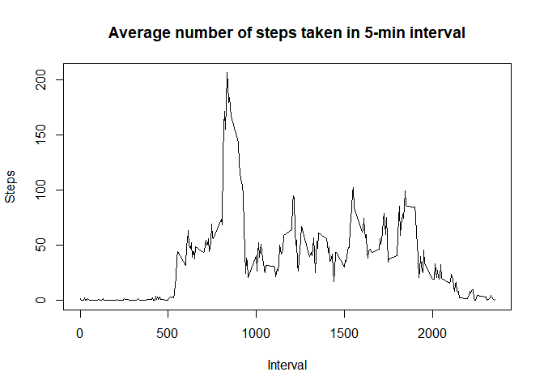
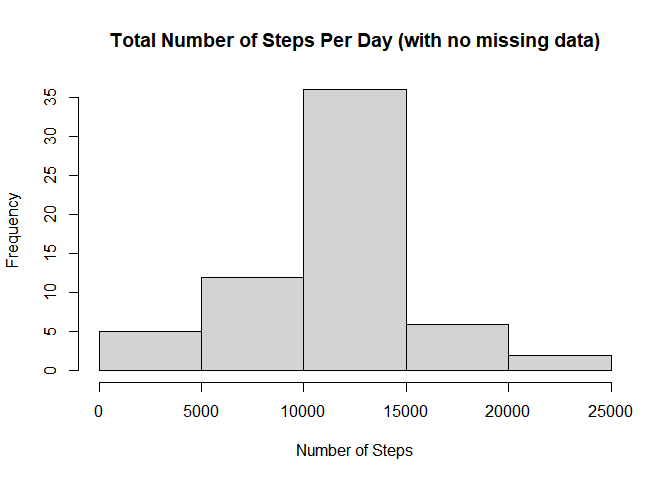
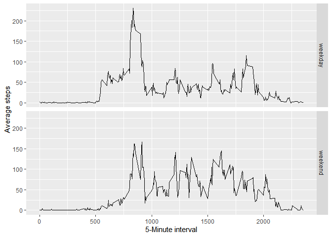

## **Step 1** : Pre-Processing Data

### *Importing required libraries*


```r
library(dplyr)
```

```
## 
## Attaching package: 'dplyr'
```

```
## The following objects are masked from 'package:stats':
## 
##     filter, lag
```

```
## The following objects are masked from 'package:base':
## 
##     intersect, setdiff, setequal, union
```

```r
library(ggplot2)
```

### *Reading and Cleaning the Data*


```r
unzip("activity.zip")
data <- read.csv("activity.csv")
data = tbl_df(data)
```

```
## Warning: `tbl_df()` is deprecated as of dplyr 1.0.0.
## Please use `tibble::as_tibble()` instead.
## This warning is displayed once every 8 hours.
## Call `lifecycle::last_warnings()` to see where this warning was generated.
```

```r
data$date = as.Date(data$date)
```

## **Step 2** : Histogram of the total number of steps taken each day

### *Grouping the data by date*


```r
dat1 <- group_by(data[complete.cases(data), ], date) %>% #remove the NAs
        summarise(total = sum(steps, na.rm = T))
```

```
## `summarise()` ungrouping output (override with `.groups` argument)
```

### *Plotting the histogram*


```r
hist(dat1$total, col = "tan", xlab = "Number of Steps",
     main = "Total Number of Steps per Day")
```

<!-- -->

## **Step 3** : Mean and median number of steps taken each day

### *Mean steps per day*

```r
mean1 <- mean(dat1$total)
print(mean1)
```

```
## [1] 10766.19
```

### *Median steps per day*

```r
median1 <- median(dat1$total)
print(median1)
```

```
## [1] 10765
```

## **Step 4** : Time series plot of the average number of steps taken

### *Grouping the data by intervals*

```r
dat2 = group_by(data, interval) %>%
        summarise(mean = mean(steps, na.rm = TRUE))
```

```
## `summarise()` ungrouping output (override with `.groups` argument)
```

### *Plotting the Time Series*


```r
plot(dat2, type = "l", main="Average number of steps taken in 5-min interval",
     ylab = "Steps", xlab = "Interval")
```

<!-- -->

## **Step 5** : Maximum average steps in 5 minute interval

### *Max number of steps*

```r
max(dat2$mean)
```

```
## [1] 206.1698
```

### *The 5-minute interval that contains the max data*


```r
dat2[which.max(dat2$mean),]$interval
```

```
## [1] 835
```

## **Step 6 and 7** : Imputing Missing Values and Plotting Histogram

1. Total number of missing Values

### *Missing values per column*

```r
colSums(is.na(data))
```

```
##    steps     date interval 
##     2304        0        0
```

2. Filling Missing Values in dataset
3. and creating new dataset


```r
dataNew <- as.data.frame(data)
dataNew$newstep <- dat2$mean
dataNew$steps[is.na(dataNew$steps)] <- dataNew$newstep
```

```
## Warning in dataNew$steps[is.na(dataNew$steps)] <- dataNew$newstep: number of
## items to replace is not a multiple of replacement length
```

```r
dataNew$newstep <- NULL
```

4. Histogram of number of steps per day with the new data

### *Grouping the new data*


```r
dat3 <- group_by(dataNew, date) %>%
        summarise(total = sum(steps))
```

```
## `summarise()` ungrouping output (override with `.groups` argument)
```

### *Plotting the Histogram*


```r
hist(dat3$total, main = "Total Number of Steps Per Day (with no missing data)",
     xlab = "Number of Steps")
```

<!-- -->

### Mean of Steps per day

```r
mean2 <- mean(dat3$total)
print(mean2)
```

```
## [1] 10766.19
```

### Median steps per day

```r
median2 <- median(dat3$total)
print(median2)
```

```
## [1] 10766.19
```

### Differences in Means and Medians


```r
print(mean2-mean1)
```

```
## [1] 0
```

```r
print(median2 - median1)
```

```
## [1] 1.188679
```

**Imputing the missing data increased the median**

## **Step 8** : Panel plot comparing the average number of steps taken per 5-minute interval across                       weekdays and weekends

### *Classifying Weekdays and Weekends*


```r
newdata <- dataNew
newdata$days <- ifelse(as.POSIXlt(newdata$date)$wday %in% c(1:5), 'weekday', 'weekend')
```

### *Panel Plot of Time Series*


```r
dat4 <- newdata %>% group_by(days, interval) %>% 
        summarise(meanSteps = mean(steps))
```

```
## `summarise()` regrouping output by 'days' (override with `.groups` argument)
```

```r
ggplot(dat4, aes(x = interval, y = meanSteps)) + geom_line() +
        labs(x ='5-Minute interval', y='Average steps') + facet_grid(days ~.) 
```

<!-- -->

**There is a decrease of average steps taken per day on the weekends**
